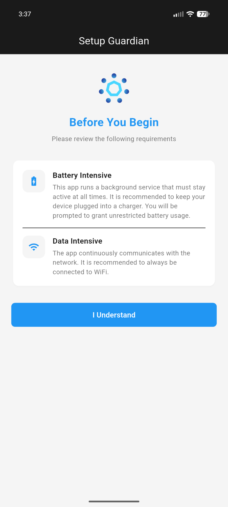
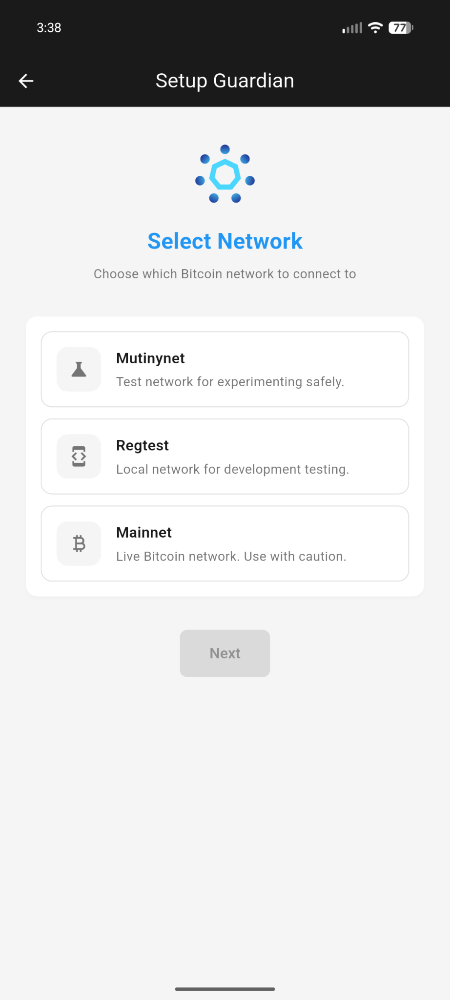
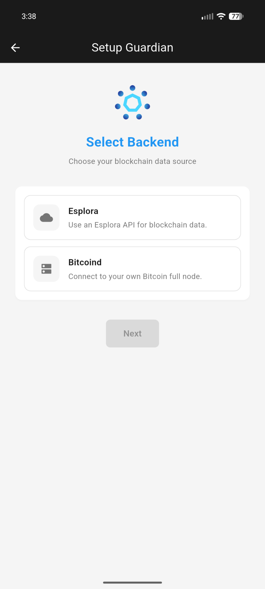
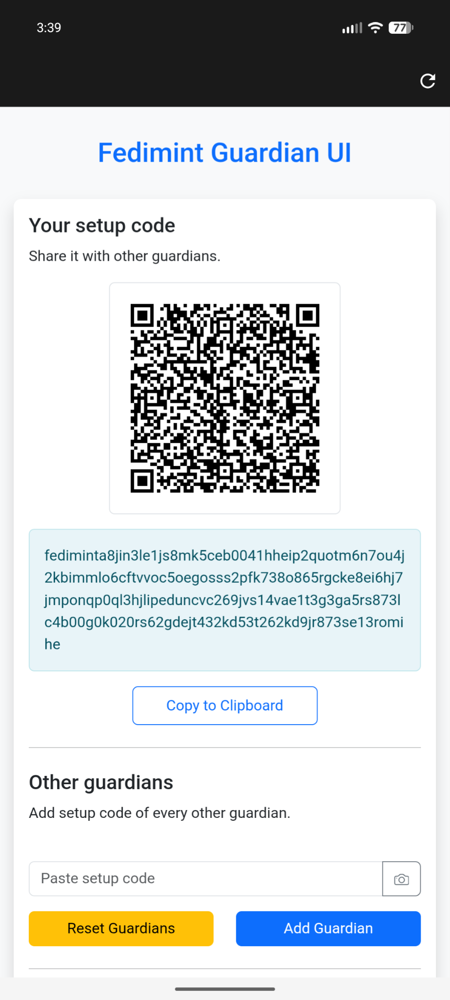
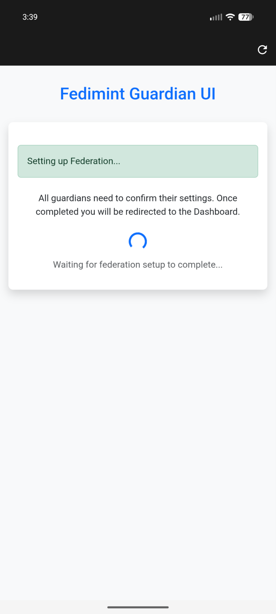

  

# Fedimint Mobile – Run a Fedimint Guardian on Your Phone

  

**Fedimint Mobile** is a Flutter-based app that allows you to run a [Fedimint](https://fedimint.org/) **Guardian node** directly on an **Android** phone.

---

## ⚠️ Warning

`fedimintd` is a server application and runs in an Android Foreground Task. It is data and battery intensive and is assumed to have constant Wifi access and plugged into a charger. It is recommended to use a old phone that is not your "daily driver".

---

## ✨ Features

- 📱 **Run a Guardian on Your Phone** – Deploy a Fedimint Guardian directly on an Android phone
- 🔒 **Easy Backup and Restore** – Backup your guardian and restore on a new phone or server whenever you need to
- 📷 **Easy Setup with QR Codes** – Scan QR setup codes with your camera for quick setup during distributed key generation
- 🌐 **Built-in Federation UI** – Manage your federation through the app's interface

---

## 📸 Screenshots

  
  
  
  
  
  
  
  
  
  
  
  
  

---

## Supported Platforms

- [Android](https://github.com/m1sterc001guy/fedimintd-mobile/releases)

---

See [contributing](./docs/contributing.md) for getting setup with a development environment.
