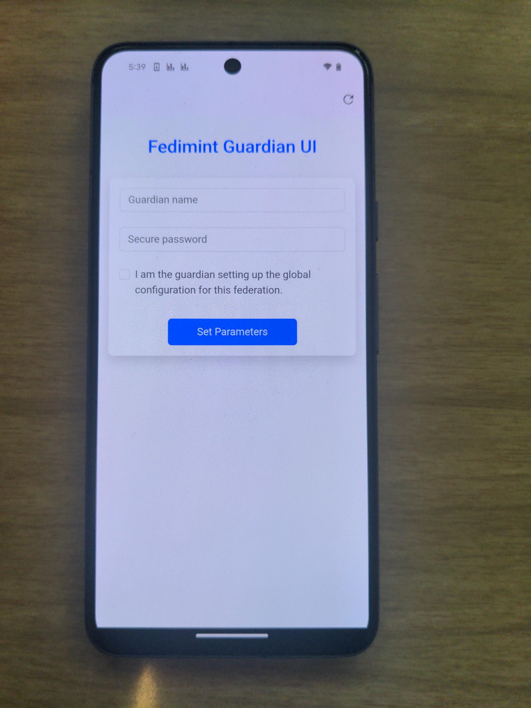
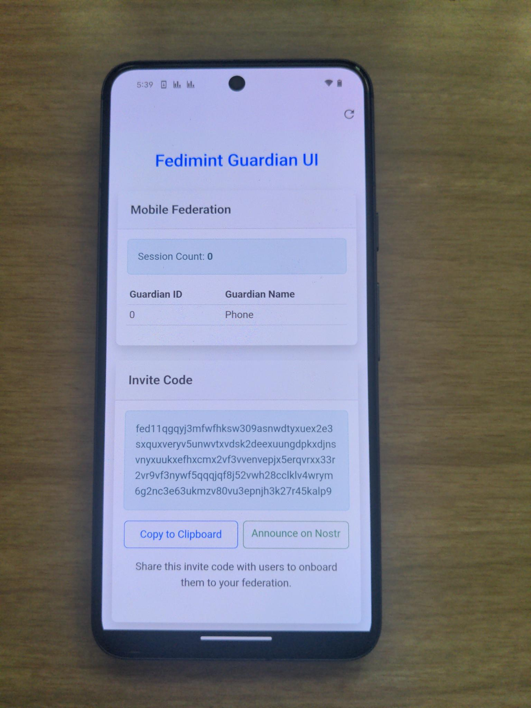

# Fedimint Mobile

Fedimintd Mobile is a Flutter-based app that allows you to run a [Fedimint](https://fedimint.org/) **Guardian node** directly on **Android** or **Linux** devices. It leverages [flutter_rust_bridge](https://github.com/fzyzcjy/flutter_rust_bridge), [iroh](https://github.com/n0-computer/iroh), and [esplora](https://github.com/Blockstream/esplora) to integrate a Rust-based `fedimintd` backend with a mobile-friendly UI.

<p algin="center">
  
  
</p>

## ⚠️ Warning: Not currently recommended for production use

While this application is just a wrapper around `fedimintd`, an Android device is typically not the ideal deployment for an always-on server application. Use at your own risk.

`fedimintd` is a server application. It is expected that this app will be open at all times and may have impact on the battery life of a phone.

## Supported Platforms
 - [Android](https://github.com/m1sterc001guy/fedimintd-mobile/releases)
 - [Linux](#development)

PRs to add iOS support are welcome.

## Why Use Fedimintd Mobile?

- **Easy setup experience** No server is required, only an Android phone or Linux machine
- **Run a portable Fedimint Guardian** Your guardian can be on the go
- **Explore Federated Ecash** Easily deploy an ecash mint in a federated or centralized configuration

## Development
Fedimint Mobile uses nix and nix flakes to manage dependencies and build the project.

First, install nix

```bash
curl --proto '=https' --tlsv1.2 -sSf -L https://install.determinate.systems/nix | sh -s -- install
```

Then enter the nix developer environment.

```bash
nix develop
```

To generate the Flutter bindings for the rust code, simply run
```bash
just generate
```

To build the rust code, run
```bash
just build-linux
just build-android-arm
```

To run the app on Linux, simply run
```bash
just run
```
